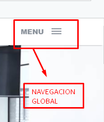
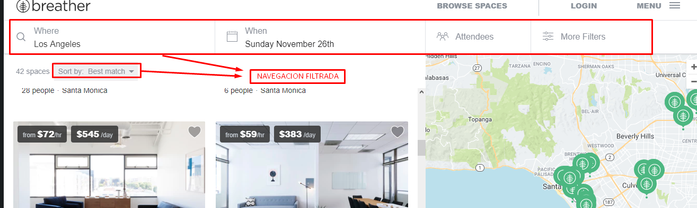
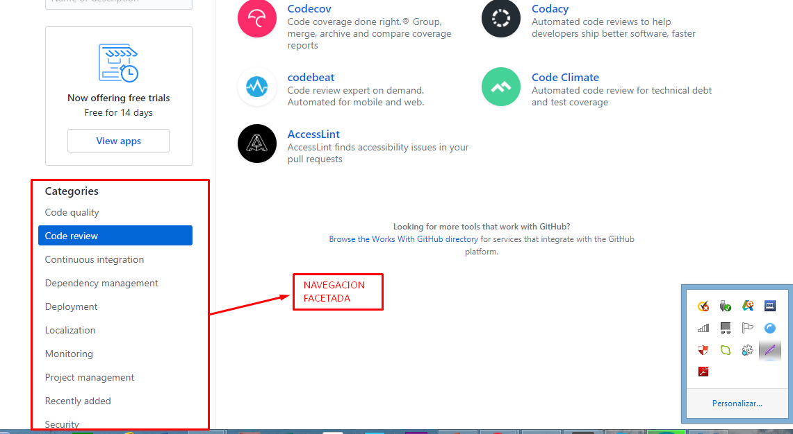
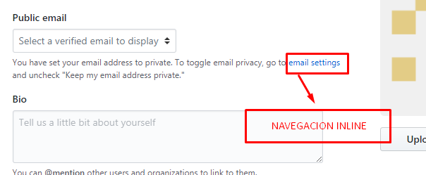
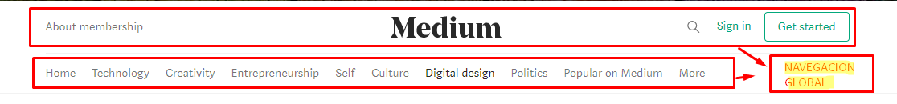
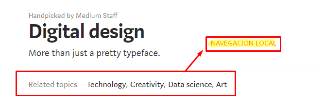

## Objetivo

2.- Identifica los elementos de navegación en los siguientes sites

### a) Breather
* NAVEGACION GLOBAL 

* NAVEGACION FILTRADA

### b) Github
* NAVEGACION FACETADA

* NAVEGACION INLINE

### c) Medium

* NAVEGACION GLOBAL

* NAVEGACION LOCAL
